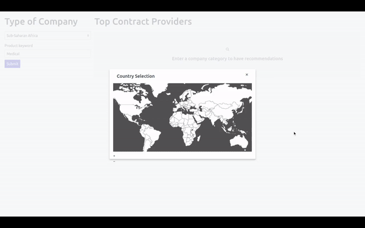

# ContractFit

To provide actionable information to companies on contract opportunities with multilateral organisations

## Context 

Currently, public procurement procedures of international organisations are complex, leading to market inefficiencies. 
Leveraging on available procurement data of UN, World Bank and NATO organised Open States from Open Data Sets (https://openmultilaterals.org/data ) our tool aims to help companies strategize their searches and applications.

This prototype was built during the ParisPeaceForum hackathon by the team composed of Syrine Souissi, Tina Emambakhsh, Selma Azennar, Camille Jehle-blanc, Zoé Fontier, and Xavier Lavayssière. Mentors were Sicco Van Sas, Kate Ashton, and Svanhildur Thorvaldsdottir.
- [Additionnal information on Paris Peace Forum website](https://hackathon.parispeaceforum.org/t/contract-fit-project/)
- [Live demo](https://xalava.github.io/ContractFit/) (Data: Medical in Sub-Saharian countries) 

## Technology

The website is built in plain HTML, CSS and vanilla JS (notably template strings from ES2015). It uses Spectre.css (layout and interface), Jvectormap (map selection) and Chartist.js. Data was analysed offline in Python (see link above).